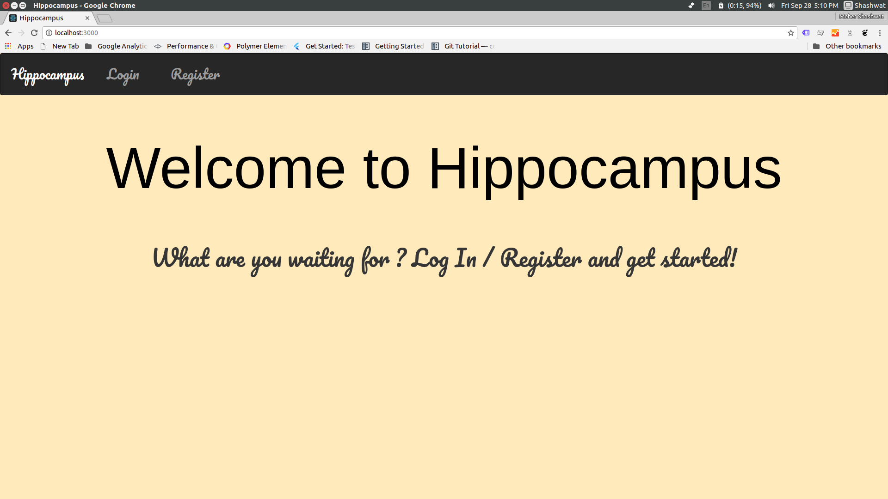
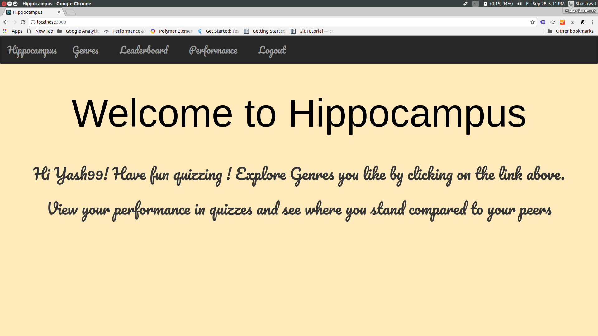
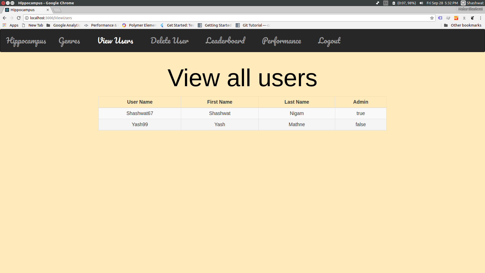
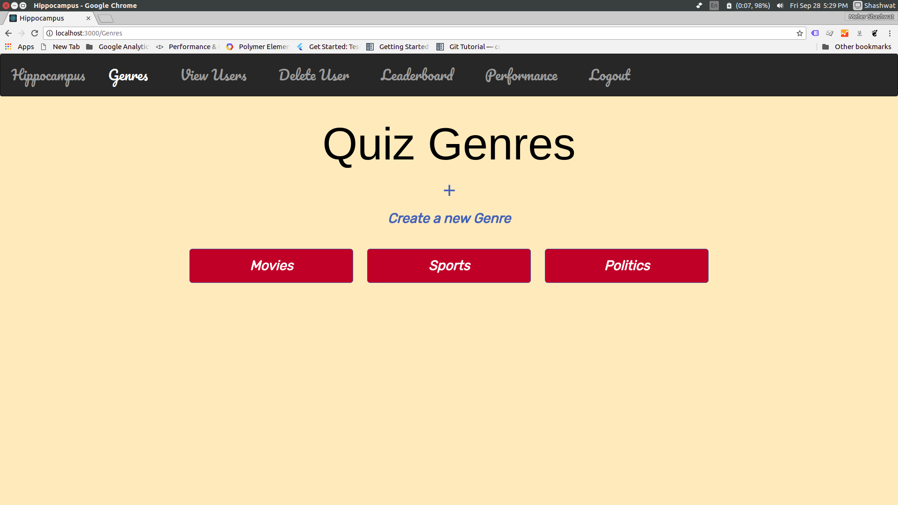
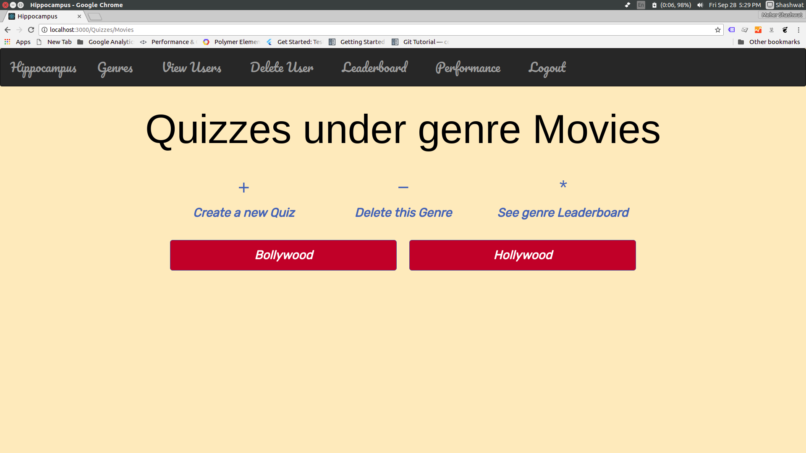
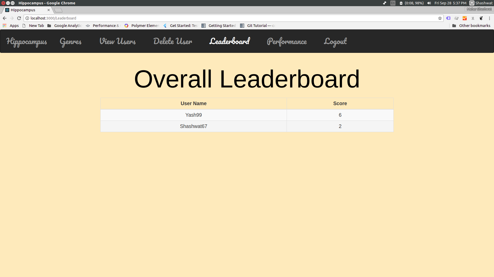
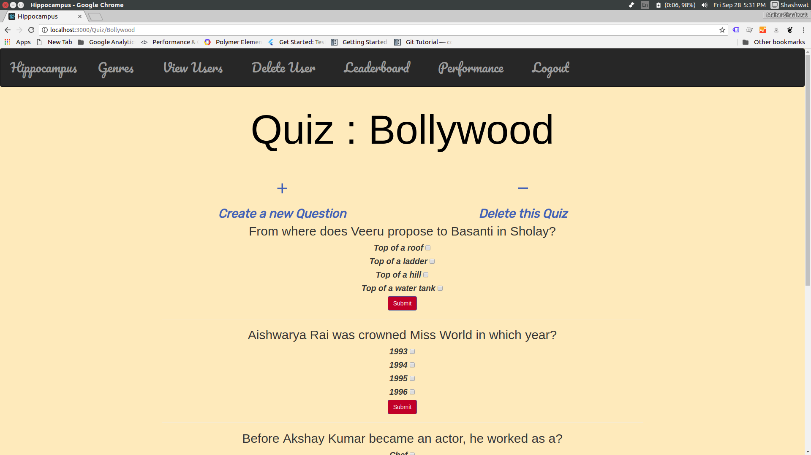
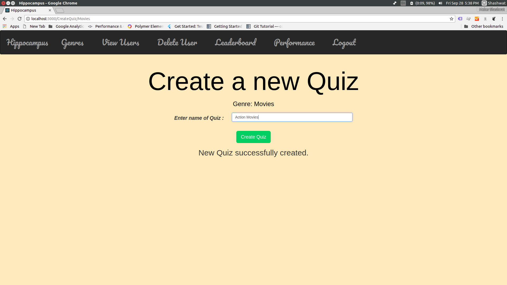
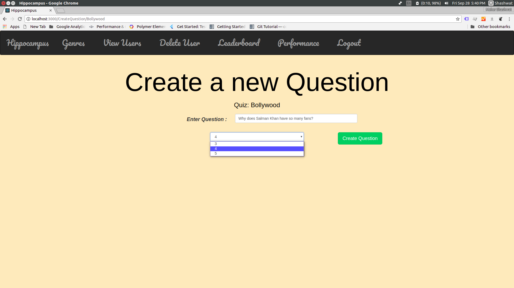
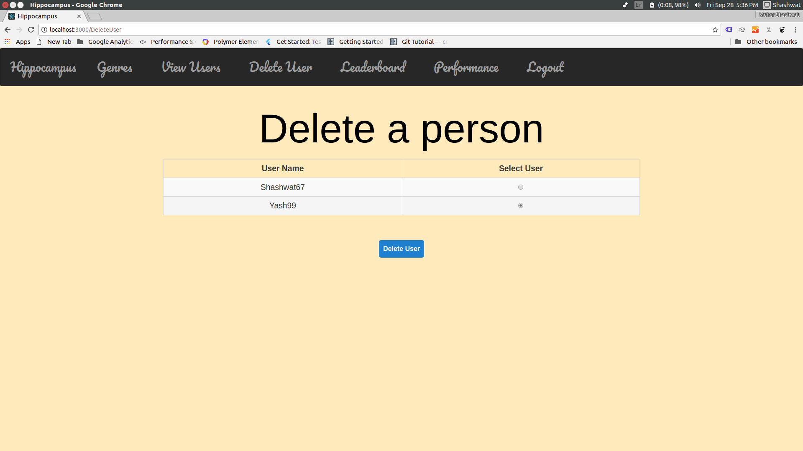

# Quiz-game
HIPPOCAMPUS - A quiz application with React.js,Bootstrap for frontend, Golang for backend- gin and gorm libraries.

## Go

### Setting up
- For Ubuntu: [Look here](https://www.linode.com/docs/development/go/install-go-on-ubuntu/)
- For MacOS: [Look here](http://sourabhbajaj.com/mac-setup/Go/README.html)
- Optional: If you want to have your executables to be stored in `bin`, add the following to your .bashrc:
```bash
              export GOBIN=$GOPATH/bin
```
- Installing third party packages; use `go get`. An example:-
```bash
        go get -u -v gopkg.in/mgo.v2
```
- You'll have to install the packages before you run the code. Packages used in this project -
```bash
              go get -u -v github.com/gin-gonic/gin
              go get -u -v github.com/jinzhu/gorm
              go get -u -v github.com/jinzhu/gorm/dialects/sqlite
              go get -u -v github.com/gin-contrib/cors
```
- To run a program:-
```bash
              go run file.go
```


## React

### Setting up
- First, install node. Then install yarn.
- Ubuntu:
```bash
              curl -sL https://deb.nodesource.com/setup_10.x | sudo -E bash -
              sudo apt-get install -y nodejs
              npm install -g yarn
```
- MacOS:
```bash
              brew install node
              npm install -g yarn
```
- In the app I've made, make sure you run `npm install` or just `yarn` inside the `react-app` folder. This command automatically looks at the `package.json` file and installs the required packages into the `node_modules` folder.
- You can run the app by running `yarn start`
## Running the application-
- Run this command inside the Hippocampus/react-app folder
```bash
             npm install
             yarn start
 ```
 - On a separate terminal instance run this in the Hippocampus/go folder
 ```bash
             go run CRUD.go
 ```
 - Go to localhost:3000 to use the application
 
## Functionalities-

### Homepage:

### Signed out


### Logged in


### Users list


### Genres


### Quizzes under a genre


### Leaderboard under a genre


### Quiz section


### Create a quiz (admin)


### Create a new question (admin)


### Delete a user (admin)

